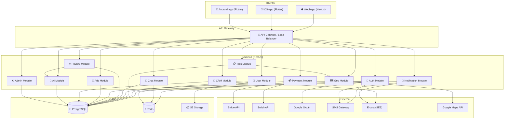
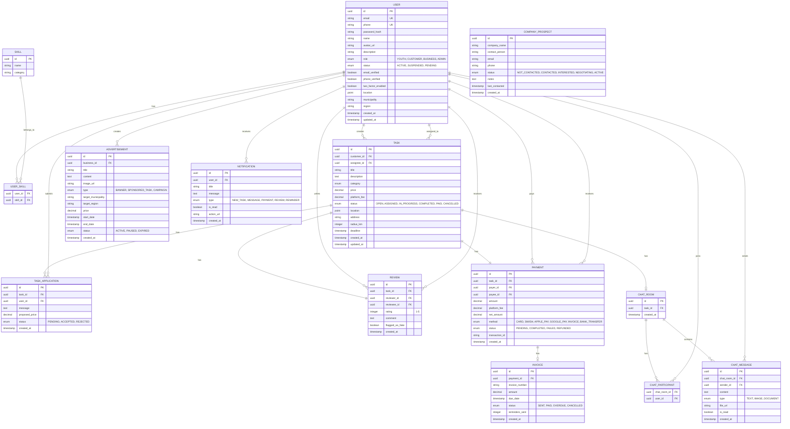
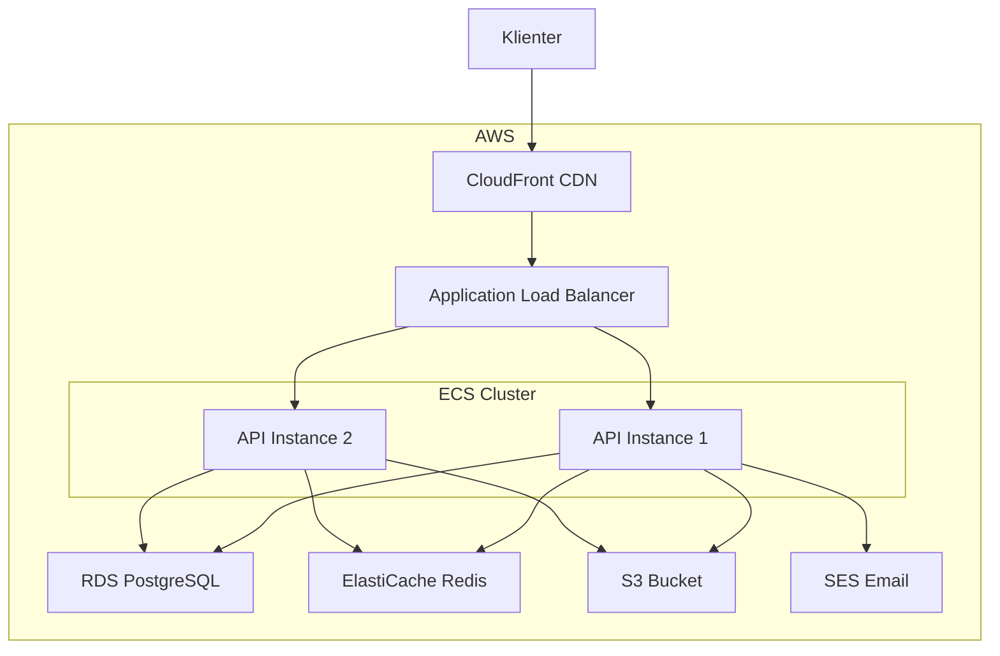

# Systemarkitektur – Marknadsplats

## Översikt

Marknadsplatsen är en distribuerad tjänsteplattform med en mikrotjänst-inspirerad monolitisk arkitektur (modular monolith). Systemet är uppdelat i separata, löst kopplade moduler som kan extraheras till mikrotjänster vid behov.

## Moduler

### 🔐 Auth Module
Hanterar all autentisering och auktorisering.
- JWT-baserad sessionshantering
- Google OAuth2 integration
- SMS-verifiering via OTP
- Tvåfaktorsautentisering (2FA)
- Glömt lösenord-flöde
- Rollbaserad åtkomst (RBAC)

### 👤 User Module
Hanterar användarprofiler och kontohantering.
- Användartyper: Ungdom, Kund, Företag, Admin
- Profilhantering (bild, beskrivning, kompetenser)
- Verifieringsstatus
- Område/plats-inställningar

### 📋 Task Module
Kärnan i marknadsplatsen – uppdragshantering.
- Skapa, redigera, ta bort uppdrag
- Statusflöde: Publicerad → Accepterad → Pågående → Slutförd → Betald
- Kategori- och underkategorihantering
- AI-baserad matchning av utförare

### 💳 Payment Module
Betalningsprocessering och provisionshantering.
- Stripe-integration (kort, Apple Pay, Google Pay)
- Swish-integration
- Provisionsberäkning (konfigurerbar %)
- Fakturering med förfallodatum och påminnelser
- Utbetalningar till utförare
- Escrow-liknande flöde

### 💬 Chat Module
Realtidskommunikation mellan användare.
- WebSocket-baserad (Socket.io)
- Text, bilder, dokument
- Läskvitton
- Pushnotiser vid nya meddelanden

### ⭐ Review Module
Recensioner och betygssystem.
- 1–5 stjärnor + skriftlig recension
- Genomsnittsbetyg
- Pålitlighetsindex
- AI-baserad detektion av falska recensioner

### 🗺 Geo Module
Geografisk sökning och kartfunktionalitet.
- PostGIS-integration
- Radie-sökning (5, 10, 25, 50 km)
- Kommun- och regionsfiltrering
- Kartvy med uppdragsmarkörer

### 📢 Ads Module
Annonssystem för företag.
- Bannerannonser
- Sponsrade uppdrag
- Kampanjhantering
- Målgruppsstyrning (stad, kommun, region)
- Fakturering av annonser

### 🏢 CRM Module
Företagsprospektering och kundhantering.
- Företagsregister
- Kontaktpersoner
- Statushantering (pipeline)
- E-posthistorik
- Automatiserade e-postmallar

### 🤖 AI Module
Intelligenta funktioner.
- Matchning: utförare ↔ uppdrag
- Bedrägeridetektering i recensioner
- Prisförslag baserat på kategori, region, komplexitet
- Sökrelevansoptimering

### 🔔 Notification Module
Pushnotiser och meddelanden.
- Nya uppdrag nära dig
- Meddelanden i chatten
- Betalningsbekräftelser
- Recensioner
- Systempåminnelser

### ⚙️ Admin Module
Administrationspanel.
- Dashboard med KPI:er
- Användarhantering
- Uppdragsöversikt
- Intäkter och provisioner
- Annonshantering
- Tvistehantering

## Databasdesign (ER-diagram)

## Säkerhetsarkitektur

### GDPR-compliance
- Användare kan exportera och radera sin data
- Samtycke krävs för databehandling
- Krypterad lagring av personuppgifter
- Data Processing Agreement (DPA) med tredjeparter

### Autentisering & Auktorisering
- JWT med kort livstid (15 min) + refresh tokens
- RBAC (Role-Based Access Control)
- API-nycklar för tredjepartsintegrationer

### Nätverkssäkerhet
- HTTPS/TLS överallt
- Rate limiting (per IP och per användare)
- CORS-konfiguration
- Input-validering och sanitering
- SQL-injection-skydd (Prisma ORM)

### Audit Logging
- Alla administrativa åtgärder loggas
- Betalningshistorik med full spårbarhet
- Inloggningsförsök loggas

## Deployment-arkitektur

